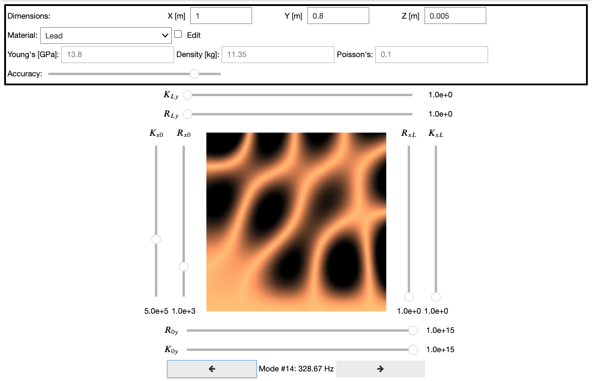

# mgpie 

## About

This is a Jupyter interface to the [magpie-python](https://github.com/nemus-project/magpie-python) source code.

## Setup

- Clone this repository using the [GitHub Desktop app](https://desktop.github.com) or clone making sure to `--recurse-submodules`. 
- Start Jupyter Notebooks. We advise to use the [Anaconda distribution](https://www.anaconda.com/download)
- Open the `MagpieJupyter.ipynb`
- Run all cells

|  |
| :--------------------------------------------: |
| Magpie Interface                               |

